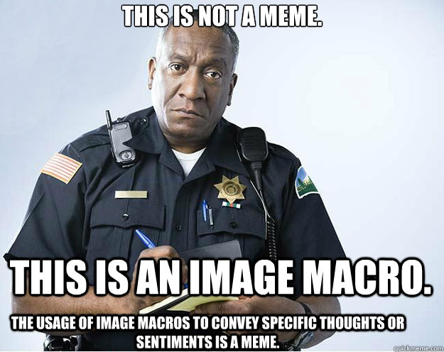

# Small task 9 - Macros

This assignment will focus on macros.

Your goal is to implement a macro for deriving builders for structs.

This task is taken from [David Tolnay's macro workshop](https://github.com/dtolnay/proc-macro-workshop#derive-macro-derivebuilder).
You can find some useful tips there. Test files themselves (in the `tests` directory) provide guidance.

You must not use any external libraries for this task (other than the ones already specified).
You must not modify the tests (obviously).

